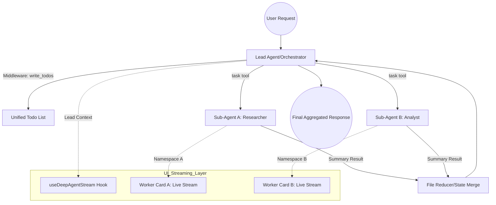
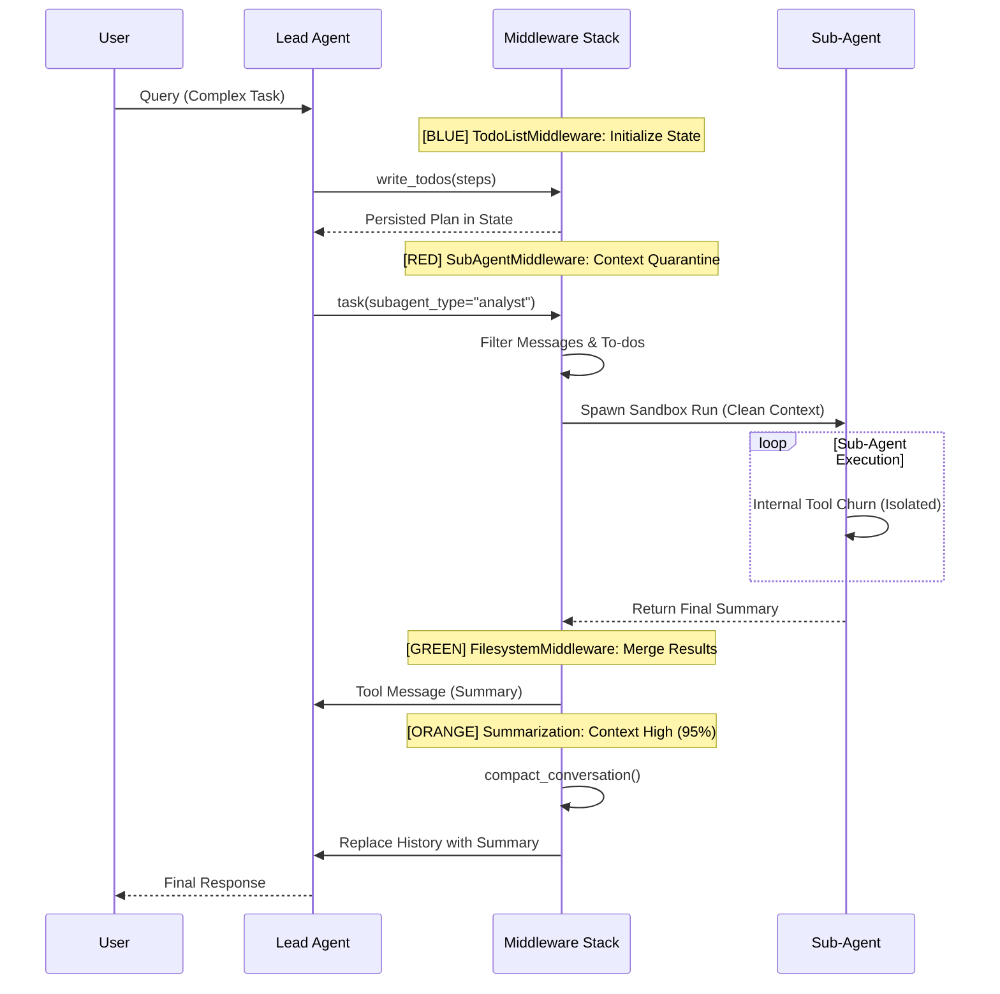

## **DeepAgent: Technical Architecture & Orchestration Summary**

### **1. Core Capabilities**

DeepAgent is a production-grade **agent harness** built on top of the LangGraph runtime, designed to resolve the "shallow loop" failure pattern common in standard ReAct architectures. It shifts the agentic model from simple reactive tool-calling to a **"Project Manager" paradigm** through an opinionated stack of middleware.

* **State-Managed Planning:** Unlike "step-by-step" prompting, DeepAgent utilizes a persistent `write_todos` tool. This tool is a **no-op state artifact** that persists a structured task list (pending, in-progress, completed) within the agent's state schema, allowing the model to adapt strategies across long-running sessions.  
* **Context Quarantine (Isolation):** DeepAgent enforces strict **state isolation** when delegating. The orchestrator filters out the main agent's chat history and to-dos before spawning a sub-agent, ensuring the specialist receives only a focused sub-task instruction. This prevents "intermediate fluff" (e.g., 50 search results) from polluting the lead agent's context.  
* **Virtual File System (VFS) & Offloading:** To handle trajectories exceeding model limits, DeepAgent employs a **pluggable VFS backend** (in-memory, local disk, or sandbox). Large tool results (>20,000 tokens) are automatically offloaded to the VFS and replaced with a file path reference and preview.  
* **Long-Context Summarization:** When the context window reaches a model-aware threshold (typically **85%–95%**), the `compact_conversation` middleware triggers. It generates a structured summary of the session history, persists the original messages to `/conversation_history/{thread_id}.md`, and replaces the active history with the summary to free up RAM/working memory.
---
**Core and extended toolset available to a **Deep Agent**, for functional purpose within the harness:**

* **Planning**: **write\_todos** (breaks complex objectives into discrete steps categorized as **pending**, **in-progress**, or **completed**).  
* **Context Engineering**: **write\_todos** (utilized as a **no-op** strategy to maintain agent focus by persisting the plan in the context), **compact\_conversation** (summarizes history and offloads original messages to the virtual filesystem when token usage hits an **85%–95% threshold**).  
* **Subagent Orchestration**: **task** (a single-dispatch tool that spawns specialized subagents for **parallel execution** and **context isolation**).  
* **Virtual Filesystem (VFS)**: **ls** (lists available files and directories), **read\_file** (reads file content with support for **line offsets and limits** to prevent context bloat), **write\_file** (creates or overwrites files in the agent's state or configured backend), **edit\_file** (performs targeted **exact string replacements** within existing files), **glob** (identifies files matching specific patterns), **grep** (searches for text patterns across the filesystem).  
* **System & Shell Execution**: **execute** (runs shell commands for tasks like building projects, running tests, or managing dependencies, typically within a **policy-governed sandbox**).  
* **External Knowledge**: **web\_search** (accesses real-time information via Tavily), **fetch\_url** (retrieves and converts web pages into **markdown format** for easier processing).  
* **Human Interaction**: **ask\_user** (allows the agent to pause and request clarification or specific input from the human operator)


---

### **2. Sub-Agent Architecture**

DeepAgent's sub-agent architecture is a hierarchical "Supervisor" model where specialists can be independent pre-compiled LangGraph objects or prompt+tool configurations.

* **Orchestration Patterns:**  
  * **Lead as Brain (Pattern A):** The recommended pattern where the lead decomposes the query and delegates focused sub-tasks. The sub-agent never sees the original user query.  
  * **Lead as Pre-processor (Pattern B):** The lead creates a roadmap and hands the full query + plan to a sub-agent for end-to-end execution.  
* **Independent Invocation:** Sub-agents can be invoked as **stateless "interns"** via the `task` tool. Each invocation is an isolated run, returning only its final summary message back to the lead.  
* **Parallelism and Conflict Resolution:** The harness explicitly directs the lead to launch sub-agents concurrently when possible. To manage simultaneous state updates, a **"file reducer"** merges dictionaries from parallel runs to prevent data loss in the VFS.

---

### **3. Streaming & Execution Model**

The execution model focuses on **UI responsiveness** and **distributed development**.

* **Multi-Stream Architecture:** DeepAgent can be exposed as a streaming HTTP endpoint. The `useDeepAgentStream` SDK hook provides a typed API to track nested sub-agent namespaces independently.  
* **Parallel Real-Time UI:** While sub-agents operate as background tasks, they stream tokens, tool calls, and status updates directly to the UI. The standard design pattern utilizes **"Sub-agent Cards"**—ephemeral UI components that render separate progress trackers for each concurrent worker (e.g., a Weather Scout and a Budget Optimizer).  
* **Aggregated vs. Intermediate:** The orchestrator streams its own reasoning alongside the sub-agent streams, allowing the user to see the "Project Manager's" planning logic as it coordinates specialist workers.

---

### **4. Benefits & Use Cases**

* **Reduced Hallucination:** By isolating sub-agent "rabbit holes" in separate context windows, the main agent's state remains "clean," reducing confusion from conflicting intermediate data.  
* **Horizontal Scalability:** Developers can mix model providers, using a cost-efficient model (e.g., Llama 3\) for the lead orchestrator and a frontier model (e.g., Claude 3.5 Sonnet) for specialist sub-agents.  
* **Complex Decision Workflows:** Effective for **Deep Research** (aggregating parallel findings), **Autonomous Coding** (split across planner, coder, and reviewer), and **Enterprise Data Silos** (querying multiple distinct DBs without context overflow).

---

### **5. Visualizations**

#### **Orchestration Flow & Multi-Stream Architecture**

#### **Sequence Diagram with Middleware Actions**

---

### **6. Examples & Implementation**

**Pseudo-code: Sub-Agent Registration**
 Position matters: tools is a required positional arg
```python
agent = create_deep_agent(

    tools=[web_search, terminal], # Hands for the lead
    subagents=[
        {
            "name": "researcher",
            "description": "Expert at deep web research",
            "tools": [tavily_search, scrape_tool],
            "prompt": "You are a research assistant. Focused on accuracy and citations and Provide concise summaries."
        }

    ]

)
```
*References: See `libs/deepagents` in the LangChain GitHub repository for the `agent_middleware` base class and `SubAgentMiddleware` implementations.*

---

### **7. Advanced Q&A**

* **Q: How does the lead handle state if a sub-agent fails?**  
  * **A:** Errors are returned as tool messages. The lead uses the `write_todos` plan to decide if it should retry, re-route to a different sub-agent, or ask the user for help.  
* **Q: Can sub-agents inherit all parent tools?**  
  * **A:** Yes. The "general-purpose" sub-agent inherits the entire toolset of the parent by default. Custom sub-agents can be restricted to specific vertical tools.  
* **Q: How is prompt cache stability maintained?**  
  * **A:** The CLI and SDK deterministically sort MCP tools and instructions to ensure system prompt segments remain static for model providers supporting prompt caching.  
* **Q: Does context isolation limit the lead’s visibility?**  
  * **A:** By default, yes. However, sub-agents can write detailed trajectories to the VFS and return a reference, allowing the lead to `read_file` only the necessary details.  
* **Q: Is there a nesting limit for sub-agents?**  
  * **A:** Architecturally no, but a 2-tier (Lead \-> Specialist) or 3-tier (Lead \-> Manager \-> Specialist) model is recommended to prevent reasoning decay.
* **Q: The "shallow loop" failure pattern?**
   The "shallow loop" failure pattern refers to a fundamental limitation in the simplest and most dominant agent architecture: an LLM running in a naive loop calling tools (often called the ReAct pattern).
   While this approach works for straightforward tasks, it frequently *breaks down when faced with longer, more complex, and non-deterministic objectives*
---

### **8. Critical Features for Advanced Users**

* **Durable Execution:** Every `create_deep_agent` returns a compiled LangGraph graph supporting **checkpointing** for long-lived sessions.  
* **Agent Client Protocol (ACP):** Supports stdio-based ACP for integration into IDEs like Zed or VS Code.  
* **Declarative Permissions:** Advanced VFS backends allow for **permission rules** controlling which sub-agents have read/write access to specific directories.  
* **Human-in-the-Loop (HITL):** Middleware can be configured to **interrupt** on sensitive tools (e.g., `write_file`, `execute`), requiring explicit human approval before state 
